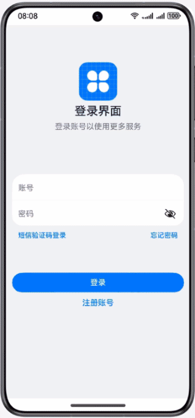

# 使用DevEco Studio高效开发

### 简介

本篇Codelab主要介绍使用DevEco Studio开发工具，高效开发登录应用的案例。效果如图所示：

### 相关概念

- 界面预览：DevEco Studio为开发者提供了UI界面预览功能，可以查看UI界面效果，方便开发者随时调整界面UI布局。
- 使用本地真机运行应用/服务：在Phone和Tablet中运行HarmonyOS应用/服务的操作方法一致，可以采用USB连接方式或者TCP的连接方式。
- 使用真机进行调试：DevEco Studio提供了丰富的HarmonyOS应用/服务调试能力，支持JS、ArkTS、C/C++单语言调试和ArkTS/JS+C/C++跨语言调试能力。
- 测试框架：DevEco Studio支持应用/服务测试框架，提供测试用例执行能力，提供用例编写基础接口，输出测试结果，支持用户开发简洁易用的自动化测试脚本，支持代码覆盖率统计。

### 相关权限

不涉及

### 使用说明

1. 打开应用，进入登录页面。
2. 输入账号和密码（任意字符），点击登录按钮跳转到应用首页。
3. 点击底部的Tabs，界面在“首页”和“我的”之间进行切换。
4. 在“我的”页面点击退出按钮退出到登录页面。

### 约束与限制

1. 本示例仅支持标准系统上运行，支持设备：华为手机。
2. HarmonyOS系统：HarmonyOS NEXT Developer Beta1及以上。
3. DevEco Studio版本：DevEco Studio NEXT Developer Beta1及以上。
4. HarmonyOS SDK版本：HarmonyOS NEXT Developer Beta1 SDK及以上。
